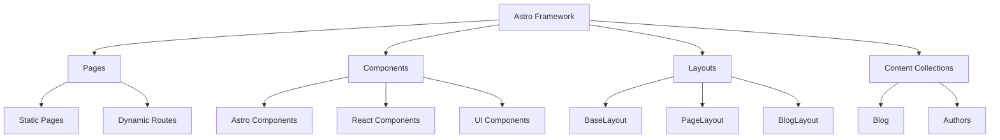
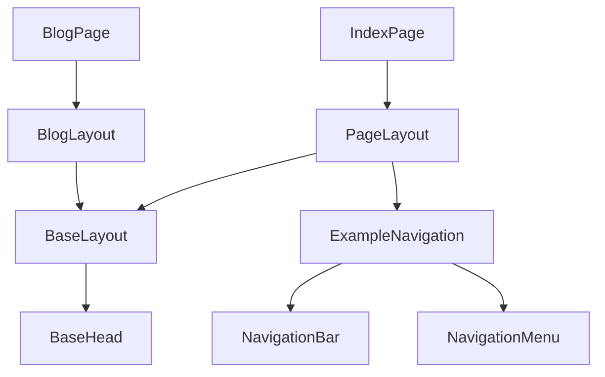

# System Patterns

## Architecture Overview

## Key Technical Decisions

### Framework Selection

- **Astro** chosen for its performance-first approach and partial hydration
- **React** used for interactive components via islands architecture
- **TypeScript** for type safety across the codebase

### Component Architecture

- Component hierarchy follows a layered approach:
  1. **Layouts**: Base structure containers (BaseLayout, PageLayout, BlogLayout)
  2. **Fragments**: Composed components for specific sections (ExampleNavigation)
  3. **UI Components**: Reusable interface elements (Typography, Stack, NavigationMenu)
  4. **Basic Components**: Simple, single-purpose components (FormattedDate, BaseHead)

### Styling Strategy

- **Tailwind CSS** for utility-first styling
- CSS variables for theming in `src/styles/theme.css`
- Component-specific styles when needed
- shadcn-ui integration for consistent UI components

### Rendering Patterns

- Static site generation for most content
- Partial hydration for interactive elements
- Client directives used to control hydration:
  - `client:load` for immediately needed interactivity
  - `client:only` for components that can't be server-rendered (e.g., Rive)

## Design Patterns in Use

### Islands Architecture

- Static HTML with islands of interactivity
- Each React component is isolated and hydrated independently
- Minimizes JavaScript sent to the client

### Component Composition

- Slot-based composition for Astro components
- Props passing for React components
- Named slots for complex component structures

### Content Management

- Content collections for structured data
- References between collections (e.g., blog posts reference authors)
- Schema validation using Zod

### Asset Optimization

- Image optimization via Astro's built-in tools
- Font preloading for performance
- Icon system using unplugin-icons

## Component Relationships

## State Management

- Minimal global state due to static-first approach
- React context used when needed for component state
- URL parameters for page-level state
